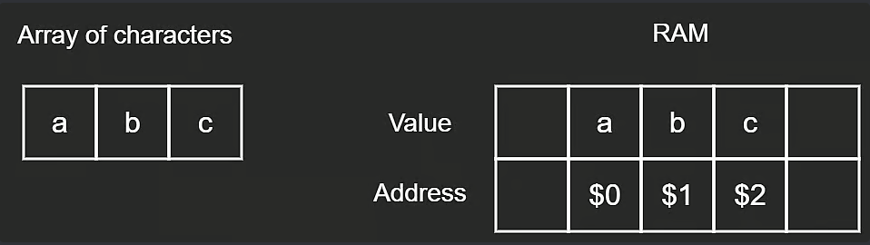

# Arrays

An array is a data structure that stores a collection of elements, each
identified by at least one array index or key. It is used to store a
fixed-size  sequential collection of elements of the same type. The elements
of an array are stored in contiguous memory locations, and their order is
determined by their position in the array.

## RAM

Random Access Memory (RAM) is a type of computer memory that can be accessed.
It is used to store data and machine code currently being used. RAM is a form of
volatile memory, meaning that it loses its contents when the power is turned off.

The array is stored in RAM, and the elements of the array are stored in 
contiguous memory locations. This allows for fast access to the elements of the
array, as the memory locations are sequential.

Here is an example of how RAM is used to store an array:



## Static vs Dynamic Arrays

### Static Arrays

A static array is an array that has a fixed size, which is determined at the time
of declaration. The size of a static array cannot be changed once it is declared.

Here is an example of a static array in C++:

```cpp
// Declare a static array of size 5
int arr[5] = {1, 2, 3, 4, 5};

// Access elements of the array
int firstElement = arr[0];
```

Complexity:

- Access: O(1)
- Insertion: O(n) (if the element is inserted at the beginning or middle of the array)
- Deletion: O(n) (if the element is deleted from the beginning or middle of the array)

### Dynamic Arrays

A dynamic array is an array that can grow or shrink in size during the 
execution of a program. The size of a dynamic array is not fixed and can be 
modified.

Here is an example of a dynamic array in C++:

```cpp
// Declare a dynamic array
vector<int> arr;

// Add elements to the array
arr.push_back(1);
arr.push_back(2);

// Access elements of the array
int firstElement = arr[0];
```

Complexity:
- Access: O(1)
- Insertion: O(1) (If the insertion is in the middle of the array, it will be O(n))
- Deletion: O(1) (If the deletion is in the middle of the array, it will be O(n))

## Conclusion

Arrays are an essential data structure in computer science, they are very 
commonly used to store collections of elements.
